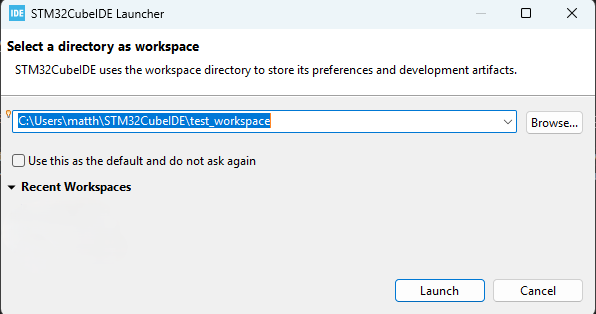
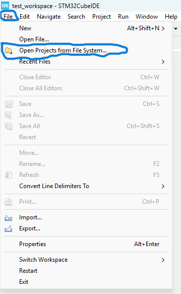
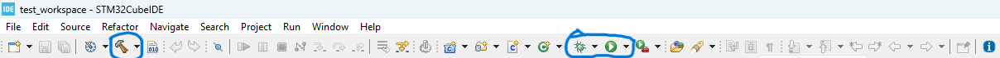

### DTMF Decoder 
DTMF (Dual Tone Multi-Frequency) refers to the tones generated by the telephone keypad when the keys are pressed. These tones were then sent through the voice channel to the other end of the phone line where the tones would be decoded. DTMF was developed by Bell Systems and was introduced to the public on Nov 18, 1963. It is a predecessor to pulse dialing.

## Hardware
- STM32-NUCLEOL476RG Dev Board
- [BOOSTXL Audio Board](https://www.ti.com/tool/BOOSTXL-AUDIO "Texas Instruments link")
- [Micro SD Card Adapter Module](https://www.amazon.com/WWZMDiB-Adater-Module-Support-Arduino/dp/B0B779R5TZ "Amazon Link")

## Installation
- Create a folder on your computer and clone this repository to it.
    ```bash
        mkdir [folder_name]
        cd [folder_name]
        git clone https://github.com/AnnonymousCoder/DTMF-Decoder.git
    ```

## Usege
- This Project was developed using [STM32 Cube IDE](https://www.st.com/en/development-tools/stm32cubeide.html#:~:text=Read%20more-,Get%20Software,-Part%20Number "STM32 Cube IDE download site") hence you will need to install it to load the project for now.
<br/>

- Once installed, Open the IDE, Create a workspace folder and choose open project from file system under file. Navigate to the folder holding the repo and select it as the project to import.
&nbsp;&nbsp;&nbsp;&nbsp;

<br/>

- To Build and Debug press the Hammer and green bug icons respectively. The play button icon is used to run without debug. 
